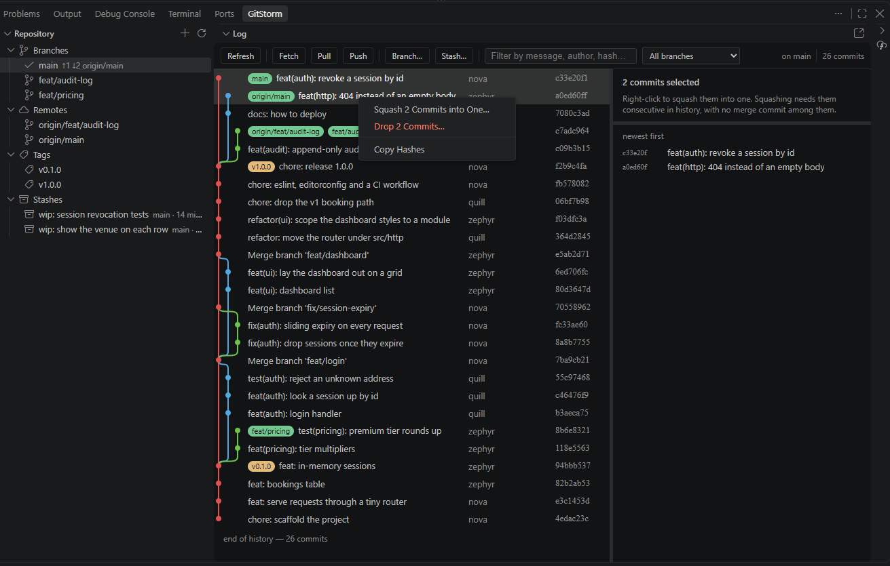
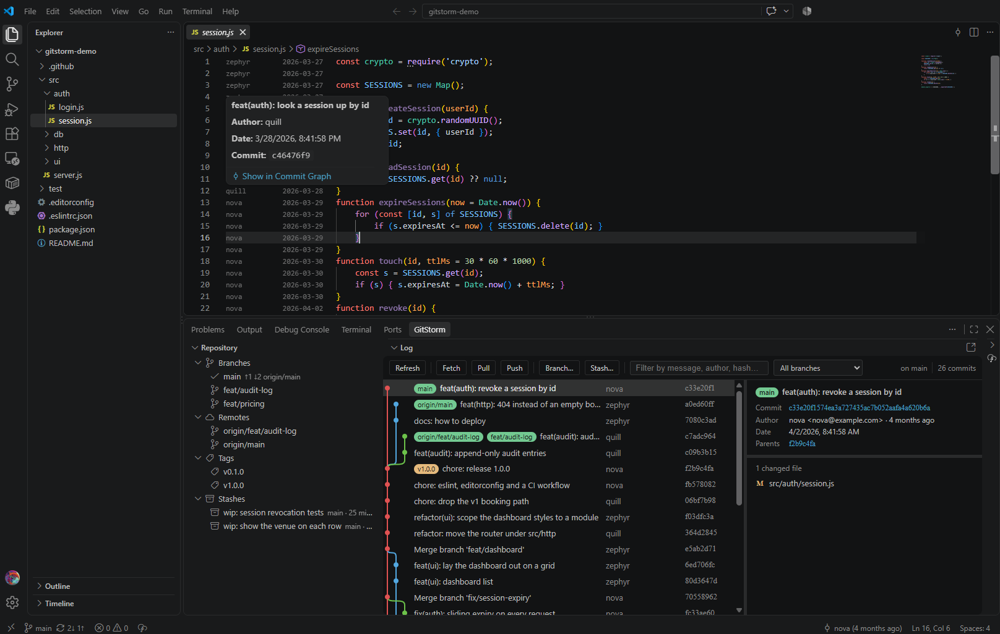

<p align="center">
  
</p>

<h1 align="center">GitStorm</h1>

<p align="center">
  <b>The JetBrains Git tool window, in Visual Studio Code.</b><br>
  A real commit graph, branch and stash management, and blame annotations —
  in the bottom panel, where your editor stays visible above it.
</p>

<p align="center">
  <a href="https://marketplace.visualstudio.com/items?itemName=Panterosa.git-storm"></a>
  <a href="https://marketplace.visualstudio.com/items?itemName=Panterosa.git-storm"></a>
  <a href="LICENSE"></a>
  
</p>

<!-- DEMO:panel — see docs/CAPTURE.md. Delete these two comment markers once docs/demo-panel.png exists.
<p align="center">
  
</p>
-->

---

## Why GitStorm

If you came to VS Code from PhpStorm, IntelliJ, or WebStorm, the Git window is
the thing you miss. VS Code's built-in Git is a staging list — it has no graph,
no branch tree, no way to squash or reword from the history.

GitStorm puts that window back:

- **It lives in the bottom panel**, next to Terminal, not in a cramped sidebar
  and not covering your code.
- **It rewrites history from the graph** — reword, squash, drop, cherry-pick,
  revert — with a confirmation that says exactly what will change.
- **It is free, MIT, and complete.** No paid tier gating the graph, no account,
  no telemetry, and no runtime dependencies — it shells out to the `git` you
  already have.

---

## Install

**[Get GitStorm on the Visual Studio Marketplace →](https://marketplace.visualstudio.com/items?itemName=Panterosa.git-storm)**

From inside VS Code: open Extensions (<kbd>Ctrl</kbd>+<kbd>Shift</kbd>+<kbd>X</kbd>),
search **GitStorm**, click Install.

From the command line:

```bash
code --install-extension Panterosa.git-storm
```

---

## Open it

Three ways, whichever is closest to hand:

1. Click the **GitStorm icon** in the status bar (bottom left) — it toggles the panel.
2. Click the **GitStorm** tab in the bottom panel, beside *Terminal* and *Problems*.
3. <kbd>Ctrl</kbd>+<kbd>Shift</kbd>+<kbd>P</kbd> → **`Git Storm: Show Commit Graph`**.

The panel holds three views side by side: **Repository** (branches, remotes,
tags, stashes), **Log** (the graph), and **File History**.

---

## What you get

### Commit graph

A coloured lane graph across every branch, tag and remote.

<p align="center">
  
</p>


- **Loads instantly on big repositories.** Commits arrive a page at a time and
  the next page loads as you scroll, so a 50 000-commit repo opens in
  milliseconds rather than freezing for seconds.
- **Filter** by message, author or hash as you type; scope the graph to one ref
  with the dropdown.
- **Commit details beside the graph** — full message, author, committer,
  clickable parents, and the changed files. Two splitters let you size the log,
  the message and the file list independently.
- **Right-click a commit**: show changes, compare with the working tree,
  checkout, branch or tag from here, edit the commit message, cherry-pick,
  revert, drop, reset (soft / mixed / hard), copy hash or message.
- **Right-click a changed file**: open the diff, open the file in the editor,
  open the revision, show its history, copy its path.
- **Select several commits** — <kbd>Ctrl</kbd>/<kbd>Cmd</kbd>+click to add,
  <kbd>Shift</kbd>+click for a range — then squash or drop them together.
- Double-click a commit to open everything it changed in one multi-file diff.
- Prefer a full tab? **`Git Storm: Open Commit Graph in an Editor Tab`**.

### Branches, remotes, tags, stashes

| Reference | Actions |
| :--- | :--- |
| **Local branch** | Checkout, new branch from, merge into current, rebase current onto, rename, safe/force delete |
| **Remote branch** | Checkout (creates the tracking branch), new branch from, merge, rebase |
| **Tag** | Checkout, new branch from, merge, delete |
| **Stash** | Stash with a message, apply, pop, drop, view its diff |

Branches show their upstream and live `↑1 ↓2` ahead/behind counts. Clicking a
ref scopes the graph to it.

### Blame

- **Annotate** — right-click the gutter, or the commit icon in the editor title
  bar, for a fixed-width `author · date` column in front of every line, the way
  PhpStorm's Annotate works. Each line sits on a band coloured by age, green for
  the newest commit in the file through to a muted mauve for the oldest, so what
  changed last is obvious without reading a single date and consecutive lines
  from one commit read as one block. Hover a line and click its hash to jump
  straight to that commit in the graph. That is the whole point: trace a line
  back to the change that caused it.
- **Inline blame** — author, relative time and subject at the end of the line
  your cursor is on, including on unsaved edits.

<p align="center">
  
</p>

### File history

Every commit that touched the active file, following renames. Click a revision
to diff it against your working copy.

---

## Rewriting history, safely

Reword, squash and drop all rewrite commits, so GitStorm refuses to start unless
a branch is checked out, the commits are on it, and the working tree is clean —
nothing uncommitted is ever swept into a rebase.

- **Edit commit message** amends the tip in place. On an older commit it replays
  everything after it. You write the message first and confirm after.
- **Squash** combines consecutive commits. The result uses exactly the message
  you type.
- **Drop** removes commits completely — the selection does *not* have to be
  consecutive. This is the one rewrite that can genuinely conflict; if it does,
  the rebase is aborted, your branch is checked out again, and the message says
  how far it got. You are never left detached or mid-rebase.

Nothing is ever pushed for you. A rewritten branch that was already pushed still
needs a force-push you make yourself.

---

## Settings

| Setting | Default | Description |
| :--- | :--- | :--- |
| `gitstorm.inlineBlame` | `true` | Show the inline blame annotation on the active line. |
| `gitstorm.graphPageSize` | `500` | Commits fetched per page. More load as you scroll, so this is a chunk size, not a ceiling. |

---

## FAQ

**Do I need to uninstall GitLens?**
No. They coexist. GitStorm's graph, panel and annotations are separate from
GitLens', though you may want to turn one extension's inline blame off so you
do not get two.

**Does it send anything anywhere?**
No. There is no telemetry, no account, and no network access of its own. Fetch,
pull and push are handed to VS Code's built-in Git extension so your existing
credentials are reused.

**Does it work with my remote / SSH / monorepo?**
It runs the `git` binary already on your PATH, so anything your `git` can do,
it can do.

**Is any feature paid?**
No. Everything above is in the MIT-licensed build.

**Does it support submodules / worktrees / partial clones?**
They are not specifically handled yet. The graph reads the repository
containing the active file, so a worktree or submodule opened as its own folder
works; nested views of both are not built.

---

## Contributing

```bash
npm install
npm test          # compiles, then runs the self-check against throwaway repos
npm run bench     # measures graph load time against generated 1k–50k commit repos
npm run demo-repo # builds a branchy repository to develop and screenshot against
```

Press <kbd>F5</kbd> for an Extension Development Host.

### Releasing

```bash
npm version patch      # the Marketplace refuses a version it already has
npm run package        # builds the .vsix
npm run publish        # builds and uploads
```

Both scripts pass `--readme-path MARKETPLACE.md`, because the listing page uses
[`MARKETPLACE.md`](MARKETPLACE.md) rather than this file — it drops the Install
and Contributing sections the Marketplace provides for itself. **Do not run
`vsce publish` directly**: it repackages from source without that flag and
quietly ships this README instead. Keep the two files in step.

The screenshot slots in both files are commented out until the images exist;
[`docs/CAPTURE.md`](docs/CAPTURE.md) says what to capture and how.

`git` is invoked directly through `child_process`; historical file contents
reach VS Code's own diff editor through a `gitstorm:` read-only content
provider, so diffs, highlighting and folding are the editor's.

Issues and pull requests: **[github.com/Aihgn/GitStorm](https://github.com/Aihgn/GitStorm)**

---

## License

MIT. Free for personal and commercial use.
